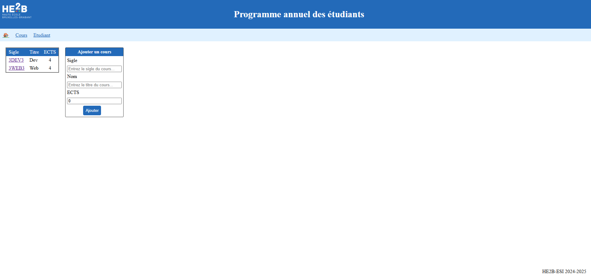
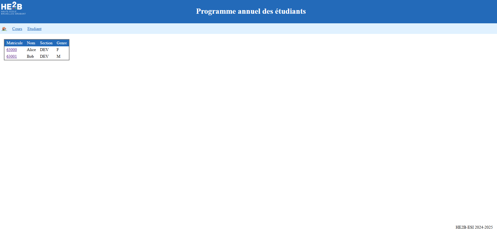
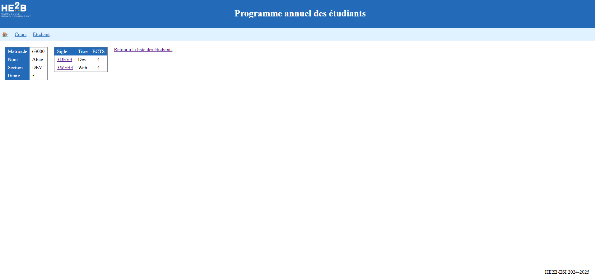

# PAE
This project is a short web application developed with Spring Boot as part of a learning exercise. It allows users to view courses and students through a simple interface : REST services, H2 in-memory database, Thymeleaf

# Features : 

- Spring Boot
- HTML & CSS
- REST services
- H2 in-memory database for data storage
- Basic front-end with Thymeleaf for displaying courses and students
- Layouts and Fragments usage

# Images :

# Launch :

mvn spring-boot:run
